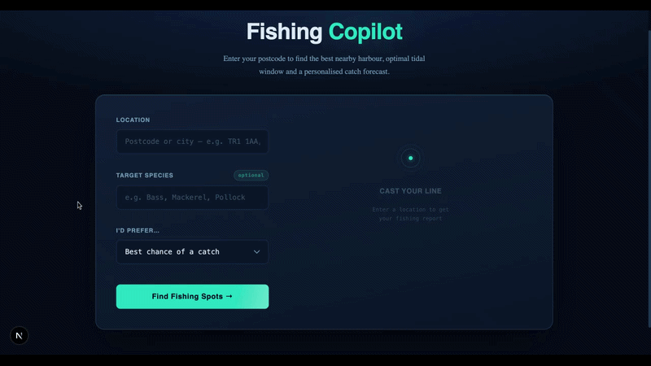
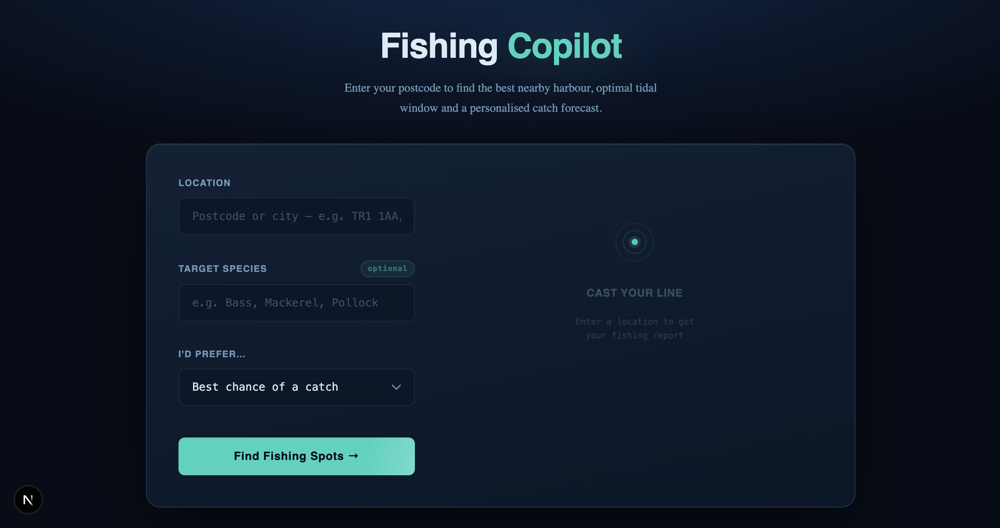
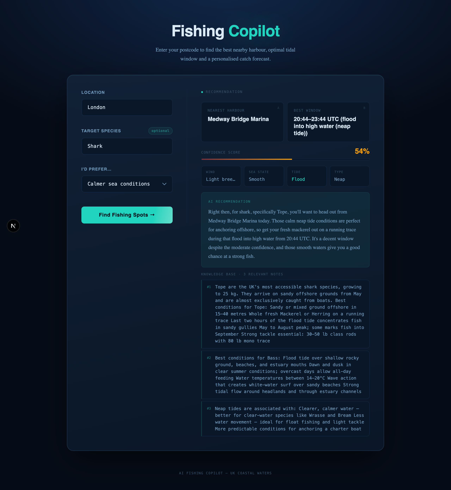

# 🎣 AI Fishing Copilot

AI-powered UK sea fishing recommendations — nearest harbour, live conditions, tidal window, and a Gemini-generated catch forecast.

[](https://github.com/Cash-Codes/AI_fishing_copilot/actions/workflows/ci.yml)
[](#)
[](#)
[](#)


## 🌐 Live Demo

🔗 https://ai-fishing-copilot-529904813075.europe-west2.run.app/

## 🎥 Demo



## ✨ Features

- Enter any **UK postcode or place name** to find the nearest harbour
- Choose your priority: **closest**, **best chance of a catch**, or **calmer conditions**
- Live **weather** from Open-Meteo (wind speed, direction, wave height, sea state)
- Astronomically calculated **tide phase** and spring/neap classification — no API key needed
- **Confidence score** combining distance, species match and season
- **RAG knowledge base** — hybrid BM25 + FAISS retrieval with Reciprocal Rank Fusion
- **Gemini-generated** plain-English explanation (falls back to a template if AI is unconfigured)
- Deterministic **mock fallback** so the app always responds, even offline

## 🖼️ Screenshots




## 🧠 Tech Stack

**Frontend**

| Technology | Version | Role |
|---|---|---|
| Next.js | 16 | React framework, server-side rendering |
| React | 19 | UI component model |
| TypeScript | 5 | Type safety across the frontend |
| Tailwind CSS | 4 | Utility-first styling |
| Jest + RTL | 30 | Component and integration tests |

**Backend**

| Technology | Version | Role |
|---|---|---|
| FastAPI | 0.115 | Web framework, automatic /docs |
| Python | 3.12 | Runtime |
| Pydantic | 2 | Request/response validation |
| Vertex AI (Gemini) | — | AI explanation generation |
| FAISS | 1.13 | Vector similarity search |
| fastembed | 0.7 | Local ONNX embeddings (all-MiniLM-L6-v2) |
| httpx | 0.28 | Async-capable HTTP client |
| pytest | 8 | Backend test suite |

**Infrastructure**

| Technology | Role |
|---|---|
| Docker (multi-stage) | Single image: nginx + uvicorn + Next.js |
| nginx | Reverse proxy; routes `/api/*` to uvicorn |
| supervisord | Process manager inside the container |
| Google Cloud Run | Production hosting |

## Architecture

```
AI_fishing_copilot/
├── backend/
│   ├── app/
│   │   ├── corpus/         Markdown knowledge base (species, tides, safety)
│   │   ├── data/           harbours.json, species.json, loader.py
│   │   ├── models/         Pydantic request and response models
│   │   ├── retrieval/      FAISS index, BM25/hybrid retriever, embedder
│   │   ├── routers/        HTTP route handlers (health, recommend)
│   │   ├── services/       Business logic (weather, tides, scoring, AI, geocoding)
│   │   ├── main.py         FastAPI app entry point
│   │   └── settings.py     Centralised env-var config
│   ├── scripts/
│   │   └── build_index.py  Build/rebuild the retrieval index from corpus
│   └── tests/              pytest test suite
├── frontend/
│   ├── app/
│   │   ├── components/     FishingForm.tsx, ResultsPanel.tsx
│   │   └── page.tsx        Homepage (Server Component)
│   └── lib/api.ts          Typed HTTP client for the backend
├── deploy/
│   ├── nginx.conf          nginx reverse proxy config
│   └── supervisord.conf    Process manager config
├── Dockerfile              Multi-stage build (Node → Python → runtime)
└── .env.example            Template for all environment variables
```

**Request pipeline:**

```
Browser → POST /recommend
  → resolve_location()          postcodes.io (UK postcode) or Nominatim (place name)
  → nearest_harbours()          Overpass/OSM API, top-5 candidates
  → get_conditions() × 5        parallel: Open-Meteo weather + astronomical tides
  → select_harbour()            preference-weighted scoring across all candidates
  → score_recommendation()      confidence score (distance × species signals)
  → retriever.retrieve_text()   hybrid BM25+FAISS with RRF → corpus notes
  → generate_explanation()      Vertex AI Gemini, or template fallback
  → RecommendResponse           JSON → ResultsPanel
```

## API

`POST /recommend`

**Request body:**

```json
{
  "location": "TR1 1AA",
  "species": "Bass",
  "preference": "best-chance"
}
```

`location` accepts any UK postcode or place name (e.g. `"Falmouth"`, `"New York"`).
`species` is optional. `preference` is one of `"closest"` | `"best-chance"` | `"calmer-conditions"`.

**Response body:**

```jsonc
{
  "input_location": "TR1 1AA",
  "nearest_harbour": "Falmouth Harbour",
  "recommendation_window": "06:15–09:15 UTC (flood into high water, spring tide)",
  "confidence_score": 0.82,
  "explanation": "Falmouth is your best match for Bass this morning...",
  "used_fallback": false,
  "out_of_range": false,
  "retrieved_notes": ["Bass move inshore from April...", "Spring tide..."],
  "retrieval_method": "hybrid-rrf",
  "wind_speed_knots": 12.4,
  "wind_direction": "SW",
  "wind_description": "Moderate breeze",
  "wave_height_m": 0.8,
  "sea_state": "Slight",
  "tide_phase": "Flood",
  "spring_or_neap": "Spring",
  "conditions_summary": "Moderate breeze (12 kn SW), slight swell (0.8 m), spring flood tide."
}
```

## 🤖 AI Integration

- Uses **Gemini 2.5 Flash** via Vertex AI for plain-English recommendation text
- Demo runs in **template mode by default** — no GCP account needed to try the app
- Real AI can be enabled by setting `GOOGLE_CLOUD_PROJECT` (see Setup below)
- **RAG pipeline**: a hybrid BM25 + FAISS retriever surfaces relevant notes from a curated fishing knowledge base, which are injected into the Gemini prompt

This ensures:

- Consistent demo experience without API quotas
- Graceful degradation when Vertex AI is unavailable or slow

## Setup

### 1. Install dependencies

**Backend** (Python 3.12, inside `backend/`):

```bash
cd backend
python -m venv .venv
source .venv/bin/activate   # Windows: .venv\Scripts\activate
pip install -r requirements.txt
```

**Frontend** (Node.js 20+):

```bash
cd frontend
npm install
```

Or run both from the root:

```bash
npm install   # installs frontend deps + root dev tools
```

### 2. Build the retrieval index

The FAISS index must be built before the backend can run:

```bash
cd backend
python scripts/build_index.py --embed
```

The `--embed` flag downloads the embedding model (~22 MB, cached after first run) and builds a hybrid BM25 + FAISS index. Without `--embed`, a keyword-only index is built and the app falls back to BM25 retrieval.

### 3. Authenticate with Google Cloud (optional — for AI explanations)

```bash
# Install gcloud CLI: https://cloud.google.com/sdk/docs/install

gcloud auth login
gcloud auth application-default login
gcloud config set project YOUR_GCP_PROJECT_ID
gcloud services enable aiplatform.googleapis.com
```

Without this step the backend generates template explanations — the rest of the app is fully functional.

### 4. Configure environment

```bash
cp .env.example .env
```

Edit `.env`. At minimum set `CORS_ALLOWED_ORIGINS` for local dev. To enable AI:

```
GOOGLE_CLOUD_PROJECT=your-gcp-project-id
```

### 5. Run both apps

```bash
npm run dev
```

Frontend: http://localhost:3000
Backend + Swagger docs: http://localhost:8000/docs

## Testing

```bash
# Frontend tests (Jest + React Testing Library)
cd frontend && npm test

# Backend tests (pytest)
cd backend && .venv/bin/pytest

# Watch mode (frontend)
cd frontend && npm run test:watch

# Coverage (frontend)
cd frontend && npm run test:coverage
```

A pre-push git hook runs the full test suite before every push.

## Docker

```bash
docker build -t ai-fishing-copilot .
docker run -p 8080:8080 \
  -e GOOGLE_CLOUD_PROJECT=your-project \
  ai-fishing-copilot
```

The container runs nginx on port 8080, which proxies `/api/*` to uvicorn and serves the Next.js app directly. No separate containers needed.

## Environment Variables

| Variable | Default | Description |
|---|---|---|
| `NEXT_PUBLIC_API_BASE_URL` | `http://localhost:8000` | Backend URL baked into the frontend bundle |
| `BACKEND_HOST` | `0.0.0.0` | uvicorn bind address |
| `BACKEND_PORT` | `8000` | uvicorn listen port |
| `CORS_ALLOWED_ORIGINS` | `http://localhost:3000` | Comma-separated allowed origins |
| `ENABLE_VERTEX_AI` | `true` | Set to `false` to force template explanations |
| `ENABLE_MOCK_FALLBACK` | `true` | Weather falls back to deterministic mock on API failure |
| `GOOGLE_CLOUD_PROJECT` | _(unset)_ | GCP project — **required** to enable AI explanations |
| `GOOGLE_CLOUD_REGION` | `us-central1` | Vertex AI region |
| `VERTEX_AI_MODEL` | `gemini-2.5-flash` | Gemini model ID |

Authentication uses [Application Default Credentials (ADC)](https://cloud.google.com/docs/authentication/application-default-credentials) — run `gcloud auth application-default login` once. No API key file required.

## V1 Trade-offs

**Intentionally left out:**

- Authentication, user accounts, or persistent history
- Real-time tide API (UKHO/WorldTides both require paid keys — astronomical calculation used instead)
- WebSockets or Server-Sent Events (standard JSON POST is sufficient for V1)
- Mobile-specific optimisations beyond responsive layout
- Multi-region deployment

**Why:** V1 targets the AI copilot layer — recommendation quality, RAG pipeline, confidence scoring, and graceful fallback handling.

## Future (V2+)

- Persistent session history and catch logging
- Real UKHO tide data via a paid API key
- Solunar tables for moon-phase feeding windows
- Retrieval over user's past catches for personalised advice
- Species image recognition (photograph your catch for ID)
- Push notifications for optimal tide windows
- Expanded harbour coverage beyond UK coastal waters

---

**Document Version:** 1.0
**Last Updated:** April, 2026
**Maintainer:** Cashley <cashley.dps@gmail.com>
