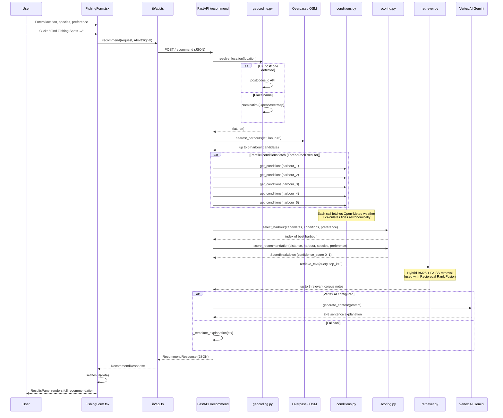

# AI Fishing Copilot — Technical Guide

---

## Table of Contents

1. [What the app does](#1-what-the-app-does)
2. [Project structure](#2-project-structure)
3. [Full request flow (diagram)](#3-full-request-flow-diagram)
4. [Frontend walkthrough](#4-frontend-walkthrough)
   - 4.1 [Entry point — `page.tsx`](#41-entry-point--pagetsx)
   - 4.2 [The form — `FishingForm.tsx`](#42-the-form--fishingformtsx)
   - 4.3 [Results display — `ResultsPanel.tsx`](#43-results-display--resultspaneltsx)
   - 4.4 [HTTP client — `lib/api.ts`](#44-http-client--libapits)
5. [Backend walkthrough](#5-backend-walkthrough)
   - 5.1 [Entry point — `main.py`](#51-entry-point--mainpy)
   - 5.2 [Settings — `settings.py`](#52-settings--settingspy)
   - 5.3 [Models — `models/request.py` and `response.py`](#53-models--modelsrequestpy-and-responsepy)
   - 5.4 [Route — `routers/recommend.py`](#54-route--routersrecommendpy)
   - 5.5 [Geocoding — `services/geocoding.py`](#55-geocoding--servicesgeocodingpy)
   - 5.6 [Harbour discovery — `services/harbour.py`](#56-harbour-discovery--servicesharbourpy)
   - 5.7 [Weather — `services/weather.py`](#57-weather--servicesweatherpy)
   - 5.8 [Tides — `services/tides.py`](#58-tides--servicesatidespy)
   - 5.9 [Conditions aggregator — `services/conditions.py`](#59-conditions-aggregator--servicesconditionspy)
   - 5.10 [Scoring — `services/scoring.py`](#510-scoring--servicesscoringpy)
   - 5.11 [AI explanation — `services/ai_explanation.py`](#511-ai-explanation--servicesai_explanationpy)
6. [RAG pipeline — `retrieval/`](#6-rag-pipeline--retrieval)
   - 6.1 [The corpus — `app/corpus/`](#61-the-corpus--appcorpus)
   - 6.2 [Data model — `Chunk`](#62-data-model--chunk)
   - 6.3 [Embedding — `retrieval/embedder.py`](#63-embedding--retrievalembedderpy)
   - 6.4 [Keyword retriever — `KeywordRetriever`](#64-keyword-retriever--keywordretriever)
   - 6.5 [FAISS retriever — `FaissRetriever`](#65-faiss-retriever--faissretriever)
   - 6.6 [Hybrid retriever — `HybridRetriever`](#66-hybrid-retriever--hybridretriever)
   - 6.7 [Building the index — `scripts/build_index.py`](#67-building-the-index--scriptsbuild_indexpy)
7. [Scoring system in depth](#7-scoring-system-in-depth)
8. [Fallback and error handling](#8-fallback-and-error-handling)
9. [Data files — `app/data/`](#9-data-files--appdata)
10. [Deployment — Docker and Cloud Run](#10-deployment--docker-and-cloud-run)
11. [Testing strategy](#11-testing-strategy)
12. [Key design decisions and trade-offs](#12-key-design-decisions-and-trade-offs)

---

## 1. What the app does

The user enters a **location** (any UK postcode or place name), an optional **target species** and a **preference** — then clicks *Find Fishing Spots*.

The app:

1. Converts the location to GPS coordinates
2. Queries OpenStreetMap for the 5 nearest harbours
3. Fetches live weather and estimated tide conditions for every candidate in parallel
4. Picks the best harbour based on the user's preference
5. Scores the recommendation (0–100% confidence)
6. Searches a curated fishing knowledge base for relevant notes
7. Asks Gemini to write a 2–3 sentence personalised explanation
8. Returns everything to the browser in a single JSON response

The response covers:

- **Nearest harbour** and **recommended time window** (e.g. "06:15–09:15 UTC, flood into high water")
- **Confidence score** — a weighted blend of how close the harbour is and how well the species/season matches
- **Live conditions** — wind speed and direction, wave height, sea state, tide phase, spring or neap
- **AI explanation** — plain-English advice written by Gemini, sounding like a knowledgeable local angler
- **Knowledge base notes** — up to 3 relevant passages retrieved from the fishing corpus

If Vertex AI is not configured, the app generates a deterministic template explanation instead. The UI is identical either way — `used_fallback: true` appears in the response so the browser can show a small notice.

---

## 2. Project structure

```
AI_fishing_copilot/
├── backend/
│   ├── app/
│   │   ├── corpus/             Markdown fishing knowledge base (4 files)
│   │   │   ├── harbour_selection.md
│   │   │   ├── safety_notes.md
│   │   │   ├── species_activity.md
│   │   │   └── tide_basics.md
│   │   ├── data/               Static JSON datasets + Python loader
│   │   │   ├── harbours.json   ~18 UK harbours with coords and descriptions
│   │   │   ├── species.json    Species seasons and preferred conditions
│   │   │   └── loader.py       Cached Pydantic loaders for both files
│   │   ├── models/             Pydantic I/O models
│   │   │   ├── request.py      RecommendRequest
│   │   │   └── response.py     RecommendResponse, HealthResponse
│   │   ├── retrieval/          RAG pipeline
│   │   │   ├── embedder.py     Local ONNX embeddings (all-MiniLM-L6-v2)
│   │   │   ├── index.json      Pre-built chunk index (keyword + embeddings)
│   │   │   └── retriever.py    KeywordRetriever, FaissRetriever, HybridRetriever
│   │   ├── routers/            HTTP handlers
│   │   │   ├── health.py       GET /health
│   │   │   └── recommend.py    POST /recommend (the main pipeline)
│   │   ├── services/           Business logic
│   │   │   ├── ai_explanation.py  Vertex AI Gemini + template fallback
│   │   │   ├── conditions.py   Combines weather + tides into FishingConditions
│   │   │   ├── geocoding.py    postcodes.io / Nominatim → (lat, lon)
│   │   │   ├── harbour.py      Overpass/OSM discovery + haversine sorting
│   │   │   ├── postcode.py     (legacy UK-only postcode helper)
│   │   │   ├── scoring.py      Confidence scoring and harbour selection
│   │   │   ├── tides.py        Astronomical tide calculation (no API)
│   │   │   └── weather.py      Open-Meteo weather + mock fallback
│   │   ├── main.py             FastAPI app + middleware + startup log
│   │   └── settings.py         Pydantic-settings env-var config
│   ├── scripts/
│   │   └── build_index.py      CLI to build/rebuild the retrieval index
│   └── tests/                  pytest test suite (7 test files)
├── frontend/
│   ├── app/
│   │   ├── components/
│   │   │   ├── FishingForm.tsx        Form + request lifecycle
│   │   │   └── ResultsPanel.tsx       Pure results renderer
│   │   ├── globals.css               Tailwind + custom CSS variables
│   │   ├── layout.tsx                HTML shell (fonts, metadata)
│   │   └── page.tsx                  Homepage (Server Component)
│   └── lib/
│       └── api.ts                    Typed fetch wrapper + ApiError
├── deploy/
│   ├── nginx.conf          Routes /api/* to uvicorn, static files to Next.js
│   └── supervisord.conf    Manages nginx, uvicorn and Next.js in one container
├── Dockerfile              Three-stage build: Node → Python → runtime
├── .env.example            All supported environment variables with comments
└── package.json            Root scripts: dev (concurrently), test
```

**Why this layout?** Each folder has exactly one job. `services/` holds logic with no HTTP concerns. `routers/` holds HTTP concerns with no business logic. `models/` documents the contract between frontend and backend. `retrieval/` is self-contained — you could swap the retriever without touching anything else.

---

## 3. Full request flow (diagram)



---

## 4. Frontend walkthrough

### 4.1 Entry point — `page.tsx`

**File:** [`frontend/app/page.tsx`](frontend/app/page.tsx)

This is the homepage (route `/`). It is a **Server Component** — Next.js renders it on the server and sends plain HTML to the browser. Server Components cannot use React state or browser APIs, but they render instantly and are great for static shells.

```tsx
export default function HomePage() {
  return (
    <main className="page-wrapper">
      <header className="page-header">
        <h1 className="page-title">Fishing<span className="title-accent"> Copilot</span></h1>
        <p className="page-subtitle">Enter your postcode…</p>
      </header>
      <div className="main-card">
        <FishingForm />  {/* <- Client Component, handles all interactivity */}
      </div>
      <footer>AI Fishing Copilot — UK coastal waters</footer>
    </main>
  );
}
```

`FishingForm` is a **Client Component** (`"use client"` at the top of the file). The boundary between Server and Client is explicit — only `FishingForm` and its children run in the browser.

---

### 4.2 The form — `FishingForm.tsx`

**File:** [`frontend/app/components/FishingForm.tsx`](frontend/app/components/FishingForm.tsx)

This is the most complex frontend file. It owns all the interactive state and drives the request lifecycle.

**State:**

```tsx
const [location, setLocation]   = useState("");
const [species, setSpecies]     = useState("");
const [preference, setPreference] = useState<"closest"|"best-chance"|"calmer-conditions">("best-chance");

const [result, setResult]   = useState<RecommendResponse | null>(null);
const [loading, setLoading] = useState(false);
const [error, setError]     = useState<string | null>(null);
```

The form has three input states (what the user typed) and three request states (what the server returned). Keeping them separate is intentional — it makes reset logic clear and prevents stale input values from leaking into the results.

**AbortController — cancelling in-flight requests:**

```tsx
const abortRef = useRef<AbortController | null>(null);

async function handleSubmit() {
  abortRef.current?.abort();          // cancel the previous request if still running
  const controller = new AbortController();
  abortRef.current = controller;

  setLoading(true);
  const data = await recommend(request, controller.signal);
  setResult(data);
}
```

`useRef` is used (not `useState`) because changing `abortRef.current` must not trigger a re-render. When the user clicks the button a second time before the first request resolves, the old request is cancelled immediately and a fresh one starts — the user always sees the latest result.

**Why is `handleSubmit` a separate function from the `onSubmit` handler?**

```tsx
<form onSubmit={(e) => { e.preventDefault(); void handleSubmit(); }}>
```

`handleSubmit` has no dependency on `SyntheticEvent`, which means tests can call it directly without simulating a DOM event. The `void` keyword suppresses the TypeScript warning about ignoring a promise return value in an event handler.

**The layout split:**

Once a result arrives, `hasOutput` becomes `true` and a CSS class switches the layout from a single centred column to a two-column split (form on the left, results on the right). On mobile the results section scrolls into view automatically:

```tsx
useEffect(() => {
  if (result && resultsRef.current && window.innerWidth < 768) {
    setTimeout(() => resultsRef.current?.scrollIntoView({ behavior: "smooth" }), 80);
  }
}, [result]);
```

**UI states:**

| State | What the user sees |
|---|---|
| Initial | Animated sonar "empty state" on the right |
| Loading | Skeleton pulse bars replace the sonar |
| Complete | `ResultsPanel` renders the full recommendation |
| Error | Red error box below the submit button |

---

### 4.3 Results display — `ResultsPanel.tsx`

**File:** [`frontend/app/components/ResultsPanel.tsx`](frontend/app/components/ResultsPanel.tsx)

A **pure presentational component** — it has no state and no side-effects. It receives a `RecommendResponse` and renders it. Because it is stateless, it has no `"use client"` directive and can be server-rendered.

```tsx
export default function ResultsPanel({ result }: { result: RecommendResponse }) {
  const confidencePercent = Math.round(result.confidence_score * 100);
  // ...
}
```

**Sections rendered:**

1. **Header row** — `RECOMMENDATION` tag and a `Template mode` badge when `used_fallback: true`
2. **Fallback notice** — explains why AI was not used (out of range, or Vertex AI unconfigured)
3. **Stat cards** — harbour name and best time window side by side
4. **Confidence gauge** — a CSS progress bar filled with a colour gradient (red → amber → teal)
5. **Conditions strip** — chips for wind, sea state, tide phase, spring/neap
6. **AI explanation** — the Gemini-generated (or template) text
7. **Knowledge base notes** — retrieved corpus passages, numbered

**Confidence colour logic:**

```tsx
function confidenceAccentColor(score: number): string {
  if (score >= 0.75) return "var(--accent)";  // teal
  if (score >= 0.40) return "var(--amber)";   // amber
  return "#ef4444";                            // red
}
```

This is a traffic-light heuristic. A score below 0.4 means either the harbour is very far away or it's the wrong season — the red colour signals "you might want to check this one".

---

### 4.4 HTTP client — `lib/api.ts`

**File:** [`frontend/lib/api.ts`](frontend/lib/api.ts)

All `fetch()` calls are centralised here. Components never call `fetch` directly — this means tests only need to mock one module, not every component.

**`ApiError` — typed HTTP errors:**

```ts
export class ApiError extends Error {
  constructor(public readonly status: number, message: string) {
    super(message);
    Object.setPrototypeOf(this, ApiError.prototype);  // fixes instanceof after TS compilation
  }
}
```

Carrying `.status` lets `FishingForm` write:

```ts
if (err instanceof ApiError && err.status === 422) {
  setError("Invalid location or input. Please check and try again.");
}
```

A plain 422 status is a validation error (the user typed something the backend rejected). A 500 is a server fault. Both are HTTP errors but they need different messages — the status code lets the caller decide without parsing a string.

**The `recommend` function:**

```ts
export async function recommend(
  request: RecommendRequest,
  signal?: AbortSignal
): Promise<RecommendResponse> {
  const res = await fetch(`${API_BASE}/recommend`, {
    method: "POST",
    headers: { "Content-Type": "application/json" },
    body: JSON.stringify(request),
    signal,   // <- wired to AbortController in FishingForm
  });
  if (!res.ok) await throwForStatus(res);
  return res.json() as Promise<RecommendResponse>;
}
```

`API_BASE` reads `NEXT_PUBLIC_API_BASE_URL` from the environment. The `NEXT_PUBLIC_` prefix is a Next.js convention that tells the build tool to embed this value in the browser bundle. Without this prefix, the variable would only be available on the server.

---

## 5. Backend walkthrough

### 5.1 Entry point — `main.py`

**File:** [`backend/app/main.py`](backend/app/main.py)

Creates the FastAPI application, configures CORS middleware, registers the two routers (`health` and `recommend`) and prints a startup summary.

```python
app = FastAPI(title="AI Fishing Copilot API", version="0.1.0")

app.add_middleware(
    CORSMiddleware,
    allow_origins=settings.cors_origins_list,
    allow_credentials=True,
    allow_methods=["*"],
    allow_headers=["*"],
)

app.include_router(health.router)
app.include_router(recommend.router)
```

**CORS** (Cross-Origin Resource Sharing) is the browser security rule that prevents JavaScript on one domain from reading responses from a different domain. Since the frontend runs on port 3000 and the backend on port 8000 during local development, CORS must be explicitly enabled. `cors_origins_list` is a comma-separated string from the environment, split into a Python list.

---

### 5.2 Settings — `settings.py`

**File:** [`backend/app/settings.py`](backend/app/settings.py)

All configuration is read from environment variables via `pydantic-settings`. Every field maps to an uppercase env var of the same name.

```python
class Settings(BaseSettings):
    backend_host: str = "0.0.0.0"
    backend_port: int = 8000
    cors_allowed_origins: str = "http://localhost:3000"
    enable_vertex_ai: bool = True
    enable_mock_fallback: bool = True
    google_cloud_project: str = ""
    google_cloud_region: str = "us-central1"
    vertex_ai_model: str = "gemini-2.5-flash"

    @property
    def vertex_ai_ready(self) -> bool:
        return self.enable_vertex_ai and bool(self.google_cloud_project)
```

`get_settings()` creates a fresh `Settings` on every call — it is deliberately not cached so that `os.environ` patches in tests take effect immediately. Creating a `Settings` object is cheap (a few env-var reads), so calling it at request time is fine.

`vertex_ai_ready` is a derived property that checks both the feature flag and the project ID. The `recommend` router calls `settings.vertex_ai_ready` to decide whether to attempt a real AI call.

---

### 5.3 Models — `models/request.py` and `response.py`

**File:** [`backend/app/models/request.py`](backend/app/models/request.py) and [`backend/app/models/response.py`](backend/app/models/response.py)

Pydantic models define the exact shape of data the API accepts and returns. FastAPI uses them to:

- Parse and validate the incoming JSON body (returns a 422 automatically if validation fails)
- Serialise the Python response object to JSON
- Generate the interactive `/docs` page

**Request model:**

```python
class RecommendRequest(BaseModel):
    location: str = Field(..., min_length=2, max_length=100)
    species: Optional[str] = Field(default=None)
    preference: Optional[Literal["closest", "best-chance", "calmer-conditions"]] = Field(
        default="best-chance"
    )
```

`location` is required (the `...` means no default). `species` is optional. `preference` is constrained to exactly three string values using `Literal` — any other string fails validation before the route handler runs.

**Response model** (`RecommendResponse`) has 17 fields including optional weather/tide conditions, a confidence score and a `used_fallback` flag so the client knows whether AI was active.

---

### 5.4 Route — `routers/recommend.py`

**File:** [`backend/app/routers/recommend.py`](backend/app/routers/recommend.py)

The main pipeline, expressed as a single FastAPI route handler. Every numbered step in the function corresponds to a step in the architecture overview.

```python
@router.post("/recommend", response_model=RecommendResponse)
def get_recommendation(body: RecommendRequest) -> RecommendResponse:

    # Step 1: Resolve location → (lat, lon)
    coords = resolve_location(body.location)
    used_fallback = coords is None

    if coords is not None:
        lat, lon = coords

        # Step 2: Find 5 nearest harbour candidates
        candidates, out_of_range = nearest_harbours(lat, lon, n=5)

        # Early return for out-of-range locations
        if out_of_range:
            return RecommendResponse(out_of_range=True, ...)

        # Step 3: Fetch conditions for all candidates in parallel
        with ThreadPoolExecutor(max_workers=5) as pool:
            all_conditions = list(pool.map(lambda hd: get_conditions(hd[0]), candidates))

        # Step 4: Select best harbour for the preference
        best_idx = select_harbour(candidates, all_conditions, body.species, body.preference)
        harbour, distance_km = candidates[best_idx]
    else:
        harbour, distance_km = default_harbour()  # fallback when location unresolvable

    # Step 5: Score the recommendation
    score = score_recommendation(distance_km, harbour, body.species, body.preference)

    # Step 6: Retrieve relevant corpus notes
    retrieved_notes = retriever.retrieve_text(query, top_k=3)

    # Step 7: Generate AI explanation
    ai_result = generate_explanation(ctx)

    return RecommendResponse(...)
```

**Why `ThreadPoolExecutor` for conditions?** `get_conditions` makes two HTTP calls (wind + waves from Open-Meteo) per harbour. Five harbours in sequence would take 5 × 2 × 4 seconds = up to 40 seconds. In parallel it takes the same as the slowest single harbour — typically under 1 second. Python's `threading` module is used rather than `asyncio` because FastAPI routes are synchronous here and `httpx` is called in blocking mode.

**Out-of-range handling:** if the nearest harbour found is more than 500 km away, the app returns immediately with `out_of_range: true` and a clear message. This prevents the app from silently recommending a harbour thousands of kilometres away when someone enters a landlocked location or an address outside UK coastal waters.

---

### 5.5 Geocoding — `services/geocoding.py`

**File:** [`backend/app/services/geocoding.py`](backend/app/services/geocoding.py)

Converts any location string into `(latitude, longitude)`. Two providers are used depending on what the user typed:

| Input type | Example | API used |
|---|---|---|
| UK postcode (full or outward) | `"TR1 1AA"`, `"SW1A"` | postcodes.io |
| Any place name | `"Falmouth"`, `"New York"` | Nominatim (OpenStreetMap) |

Detection is regex-based:

```python
_UK_POSTCODE_RE = re.compile(
    r"^[A-Z]{1,2}[0-9][0-9A-Z]?(\s*[0-9][A-Z]{2})?$",
    re.IGNORECASE,
)
```

Anything that matches is sent to postcodes.io. Everything else goes to Nominatim.

**Why two providers?** postcodes.io is very fast and accurate for UK postcodes. Nominatim covers the whole world but is slower. The combination gives UK users fast local results while still supporting international locations.

**Nominatim best-match selection:**

```python
best = max(results, key=lambda r: float(r.get("importance", 0)))
```

Nominatim can return multiple results for the same query (e.g. "London" matches districts in Canada, Kentucky and the UK). Sorting by the `importance` field — an OpenStreetMap relevance signal — picks the most well-known result. Returns `None` on any failure; callers handle this with a safe default.

---

### 5.6 Harbour discovery — `services/harbour.py`

**File:** [`backend/app/services/harbour.py`](backend/app/services/harbour.py)

Finds the nearest harbours for a given coordinate using the Overpass API, which queries OpenStreetMap data in real time.

**Two-pass Overpass query strategy:**

```
Pass 1 (fast): seamark:type=harbour + seamark:type=fishing_harbour
  → sparse data, fast query, works for most UK coastal locations

Pass 2 (full): all harbour/marina tags, wider search radius
  → used only when pass 1 returns nothing (e.g. sparsely tagged coastlines)
```

This two-pass approach prevents timeouts in dense urban areas (like New York City, where querying all harbour tags simultaneously can exceed Overpass's timeout). Two Overpass endpoint URLs are tried in order — a primary and a mirror — so a single endpoint outage does not take down the feature.

**Success-only caching:**

```python
_OVERPASS_CACHE: Dict[Tuple[float, float], Tuple[Harbour, ...]] = {}
```

Results are cached by rounded coordinate (0.5° grid ≈ 55 km cell) but **only on success**. A failed or empty response is never cached — the next request will retry Overpass. This prevents a transient 504 from permanently poisoning the cache for a location.

**Haversine distance:**

```python
def haversine_km(lat1, lon1, lat2, lon2) -> float:
```

The **haversine formula** gives the great-circle distance between two GPS coordinates. It accounts for the Earth's curvature, which matters over distances of more than a few kilometres. All 5 candidates are sorted by this distance, nearest first.

**Fallback:** if Overpass is entirely unavailable, the local `harbours.json` dataset is used. If location resolution also failed, `default_harbour()` returns Falmouth with a distance of `-1.0` (a sentinel meaning "unknown distance").

---

### 5.7 Weather — `services/weather.py`

**File:** [`backend/app/services/weather.py`](backend/app/services/weather.py)

Fetches current wind and wave conditions from the Open-Meteo API — free, no API key required.

**Two sequential API calls per harbour:**

```python
wind  = _fetch_wind(harbour.latitude, harbour.longitude)
# → api.open-meteo.com → wind_speed_10m (knots), wind_direction_10m (degrees)

waves = _fetch_waves(harbour.latitude, harbour.longitude)
# → marine-api.open-meteo.com → wave_height (m), wave_period (s)
```

Both have a 4-second timeout and retry once on a 429 (rate-limit) response. The retry handles the case where parallel requests for 5 harbour candidates all arrive at Open-Meteo at the same moment.

**Unit conversions:**

```python
def _degrees_to_compass(degrees: float) -> str:
    labels = ["N", "NNE", "NE", "ENE", "E", ...]
    return labels[round(degrees / 22.5) % 16]

def _beaufort_description(knots: float) -> str:
    if knots < 7:  return "Light breeze"
    if knots < 11: return "Gentle breeze"
    ...
```

Wind direction is converted from meteorological degrees (0° = North, clockwise) to a 16-point compass label. Wind speed is classified with the Beaufort scale. Wave height uses the Douglas scale for sea state.

**Deterministic mock fallback:**

```python
def _seeded_rng(harbour_id: str, today: date) -> random.Random:
    digest = hashlib.sha256(f"{harbour_id}:{today.isoformat()}".encode()).hexdigest()
    return random.Random(int(digest[:8], 16))
```

When Open-Meteo is unreachable, a deterministic random number generator seeded by the harbour ID and today's date generates plausible weather. The same harbour always produces the same mock weather on a given day — tests are repeatable and demo sessions are consistent, even offline.

---

### 5.8 Tides — `services/tides.py`

**File:** [`backend/app/services/tides.py`](backend/app/services/tides.py)

Estimates tidal conditions **astronomically** — no external API needed.

**Why no API?** There is no reliable free UK tide API. The UKHO Admiralty API and WorldTides both require paid keys. Fortunately, the main signals we need — spring/neap classification and tide phase — can be calculated from the moon's position.

**Spring / neap classification:**

```python
def lunar_age(today: date) -> float:
    days_since_ref = (today - date(2000, 1, 6)).days  # known new moon reference
    return days_since_ref % 29.53058868               # mean lunar cycle

def tidal_coefficient(age: float) -> float:
    phase_rad = (age / 14.765) * math.pi
    return round(abs(math.cos(phase_rad)), 3)
```

The tidal coefficient peaks at 1.0 at new moon and full moon (spring tides — strongest currents) and reaches 0.0 at the quarter moons (neap tides — weakest). This is physically motivated: tidal range is proportional to the cosine of the lunar phase angle.

**Tide phase — Flood, High Water, Ebb, Low Water:**

Each harbour has a "port establishment time" (HWF&C — High Water Full and Change), sourced from Admiralty Tide Tables. This is the time of high water at that harbour on the day of a new moon. By advancing this time by ~50 minutes per lunar day, we estimate when high water occurs today.

```python
_PORT_ESTABLISHMENT = {
    "falmouth": 6.50,  # HW ~06:30 UTC at new moon
    "newlyn":   6.25,
    "padstow":  6.00,
    ...
}
```

The phase is then determined by how many hours have elapsed since the last high water:

```python
def _phase_label(hours_since_hw: float) -> str:
    if hours_since_hw < 1.0: return "High Water"
    if hours_since_hw < 5.7: return "Ebb"
    if hours_since_hw < 7.0: return "Low Water"
    return "Flood"
```

**Accuracy:** typically within ±1 hour of the real tide. Good enough to advise "fish on the flood" but not for navigation.

---

### 5.9 Conditions aggregator — `services/conditions.py`

**File:** [`backend/app/services/conditions.py`](backend/app/services/conditions.py)

Combines `WeatherConditions` and `TideConditions` into a single `FishingConditions` object and derives two human-readable outputs.

**Recommended time window:**

```python
def _build_time_window(tides, weather) -> str:
    if weather.wave_height_m > 2.5:
        # Rough: recommend Low Water for sheltered marks
        return f"{lw_start}–{lw_end} UTC (low water, sheltered marks recommended)"
    else:
        # Standard: fish the flood run 2 hours before → 1 hour after high water
        return f"{hw_start}–{hw_end} UTC (flood into high water, {spring_or_neap} tide)"
```

UK shore anglers traditionally fish the **flood run** — the two hours before high water when baitfish are pushed up over structure and predators feed aggressively. When wave height exceeds 2.5 m the recommendation shifts to low water instead, when conditions around sheltered harbours are calmer.

**Conditions summary:**

```python
def _build_summary(weather, tides) -> str:
    return (
        f"{weather.wind_description} ({weather.wind_speed_knots:.0f} kn {weather.wind_direction}), "
        f"{weather.sea_state.lower()} swell ({weather.wave_height_m:.1f} m), "
        f"{tides.spring_or_neap.lower()} {tides.tide_phase.lower()} tide. "
        f"Next HW {tides.next_high_water}."
    )
```

This one-line summary goes into both the API response and the Gemini prompt.

---

### 5.10 Scoring — `services/scoring.py`

**File:** [`backend/app/services/scoring.py`](backend/app/services/scoring.py)

Two separate scoring functions: one selects the best harbour, the other computes the confidence score shown to the user.

**Harbour selection — `select_harbour()`:**

Each candidate harbour is scored on three independent signals, then the signals are weighted according to the user's preference:

| Signal | How it's measured |
|---|---|
| Proximity | Hyperbolic decay: `1 / (1 + distance / 20)` — 0 km → 1.0, 20 km → 0.5 |
| Calm | `(1 - wave/4) + (1 - wind/32) / 2` — lower wave/wind → higher score |
| Fishing quality | Tide phase (Flood = 1.0, Ebb = 0.55, Low = 0.30) × neap factor (0.75 for neap) |

Preference weights:

| Preference | Proximity | Calm | Fishing quality |
|---|---|---|---|
| `closest` | 0.85 | 0.15 | 0.00 |
| `calmer-conditions` | 0.30 | 0.70 | 0.00 |
| `best-chance` | 0.25 | 0.00 | 0.75 |

For `best-chance`, fishing quality is blended with a species/season match score before being weighted.

**Confidence scoring — `score_recommendation()`:**

A simpler two-signal score shown to the user as a percentage:

| Signal | How it's computed |
|---|---|
| Distance | Linear decay: `max(0, 1 - distance / 200)` — 0 km → 1.0, ≥ 200 km → 0.0 |
| Species | 0.1 (wrong place, wrong season) to 1.0 (right place, in season) |

```python
_PREFERENCE_WEIGHTS = {
    "closest":           (0.80, 0.20),  # distance matters more
    "best-chance":       (0.35, 0.65),  # species match matters more
    "calmer-conditions": (0.50, 0.50),  # equal weight
}
confidence = distance_weight * distance_score + species_weight * species_score
```

**Species scoring bands:**

| Situation | Score |
|---|---|
| No species specified | 0.5 (neutral) |
| Harbour not known for species + out of season | 0.1 |
| In season but harbour not known for species | 0.3 |
| Known harbour, wrong time of year | 0.6 |
| Known harbour + in season | 1.0 |

Harbour match is a case-insensitive substring check on `short_description`. Season parsing handles ranges that wrap around the calendar year (e.g. Cod: "October–March").

---

### 5.11 AI explanation — `services/ai_explanation.py`

**File:** [`backend/app/services/ai_explanation.py`](backend/app/services/ai_explanation.py)

Generates the plain-English recommendation text.

**Prompt structure:**

```python
def _build_prompt(ctx: ExplanationContext) -> str:
    return f"""\
You are a helpful UK sea fishing assistant giving advice to an angler.
Write a friendly, specific recommendation in exactly 2-3 sentences.
Sound like an experienced local angler — practical, encouraging and concise.
Do not use markdown, bullet points, or headings. Plain sentences only.

Angler's request
  Postcode: {ctx.postcode}
  Target species: {ctx.species or "general sea fishing"}
  Preference: {ctx.preference or "best-chance"}

Recommendation
  Nearest harbour: {ctx.harbour_name} ({dist_str})
  Harbour notes: {ctx.harbour_description}
  Best window today: {ctx.recommendation_window}
  Conditions: {ctx.conditions_summary}
  Confidence: {ctx.confidence_score:.0%}

Relevant fishing guidance
{notes_block}  ← retrieved corpus notes injected here

Write the recommendation now (2-3 sentences, no markdown):"""
```

The prompt gives the model all the facts it needs — harbour, conditions, species, corpus notes — and constrains the output format tightly. This produces consistent, useful responses rather than generic boilerplate.

**Fallback chain:**

```python
def generate_explanation(ctx) -> ExplanationResult:
    if not settings.vertex_ai_ready:
        return _template_explanation(ctx)  # AI disabled or project not set
    try:
        return _vertex_generate(ctx)       # call Vertex AI Gemini
    except Exception as exc:
        logger.warning("Vertex AI failed (%s) — using template", exc)
        return _template_explanation(ctx)  # network error, quota, auth, etc.
```

The template fallback is a deterministic string that combines the harbour name, description, recommended window and confidence score. It is always correct and never empty — the guaranteed safe path.

**Vertex AI configuration:**

```python
vertexai.init(project=settings.google_cloud_project, location=settings.google_cloud_region)
model = GenerativeModel(settings.vertex_ai_model)
response = model.generate_content(prompt, generation_config=GenerationConfig(
    temperature=0.4,        # slightly creative but mostly factual
    max_output_tokens=4096,
    candidate_count=1,
))
```

`temperature=0.4` sits between fully deterministic (0.0) and creative (1.0). We want the model to sound natural and slightly varied across calls, but not to hallucinate facts.

---

## 6. RAG pipeline — `retrieval/`

RAG stands for **Retrieval-Augmented Generation**. Instead of relying on Gemini's training knowledge alone, we retrieve relevant passages from a curated corpus and inject them into the prompt. This grounds the explanation in facts specific to UK sea fishing.

### 6.1 The corpus — `app/corpus/`

Four Markdown files, each covering a distinct topic:

| File | Topic key | Contents |
|---|---|---|
| `species_activity.md` | `species_activity` | Season, preferred conditions and behaviour for ~10 UK species |
| `tide_basics.md` | `tide_basics` | How tides affect fishing, spring/neap differences, best phases |
| `harbour_selection.md` | `harbour_selection` | How to choose between harbour types and locations |
| `safety_notes.md` | `safety_notes` | Cliff fishing, weather windows, VHF radio, clothing guidance |

The `build_index.py` script splits these files into chunks (one heading section per chunk) and stores them in `retrieval/index.json`.

---

### 6.2 Data model — `Chunk`

```python
@dataclass
class Chunk:
    chunk_id: str
    topic: str      # e.g. "species_activity"
    heading: str    # e.g. "Bass (Dicentrarchus labrax)"
    text: str       # the full section text
    word_count: int
    embedding: Optional[List[float]]  # None in keyword-only indexes
```

Every chunk carries a `topic` tag from its source file. This enables **metadata filtering** — when the user asks about Bass, retrieval can be pre-restricted to `species_activity` chunks before any scoring.

---

### 6.3 Embedding — `retrieval/embedder.py`

**File:** [`backend/app/retrieval/embedder.py`](backend/app/retrieval/embedder.py)

Generates sentence embeddings using `fastembed` — a library that runs embedding models locally via ONNX Runtime. No GPU, no PyTorch, no API key needed.

```python
MODEL_NAME = "sentence-transformers/all-MiniLM-L6-v2"
DIMENSIONS = 384
```

**all-MiniLM-L6-v2** is a well-established embedding model that produces 384-dimensional vectors. It is compact (~22 MB) but highly capable for sentence similarity tasks.

Embeddings are **L2-normalised** (converted to unit vectors) so that inner product equals cosine similarity:

```python
norms = np.linalg.norm(raw, axis=1, keepdims=True)
return raw / norms  # unit vectors: inner_product(a, b) == cosine_similarity(a, b)
```

This lets FAISS's `IndexFlatIP` (inner product index) behave as a cosine similarity index without any extra computation.

---

### 6.4 Keyword retriever — `KeywordRetriever`

A lightweight **BM25-inspired scorer** using only Python's standard library — no dependencies.

```python
def _keyword_score(query_tokens, chunk) -> float:
    tf_score = sum(chunk_tokens.count(t) for t in set(query_tokens))
    normalised = tf_score / max(1, math.sqrt(chunk.word_count))  # TF / √word_count
    phrase_bonus = 1.5 if query_phrase in chunk_lower else 1.0
    return normalised * phrase_bonus
```

Term Frequency is normalised by the square root of the chunk's word count — longer chunks are penalised less harshly than in strict BM25, but the effect is similar. A 1.5× bonus is applied when the full query phrase appears verbatim in the chunk, rewarding exact matches.

Stop words (`"a"`, `"the"`, `"and"`, ...) are stripped before scoring so they don't dilute the signal.

---

### 6.5 FAISS retriever — `FaissRetriever`

Uses **FAISS** (Facebook AI Similarity Search) to find the corpus chunks whose embeddings are most similar to the query embedding.

```python
dim = embeddings.shape[1]            # 384
self._index = faiss.IndexFlatIP(dim) # in-memory inner product index
self._index.add(embeddings)          # load all chunk vectors
```

**Two retrieval paths:**

1. **Unfiltered** — uses the pre-built FAISS index. Fast approximate nearest-neighbour search.
2. **Metadata-filtered** — when `filter_topic` is set, restricts to matching chunks first, then runs an exact numpy dot-product over that subset.

```python
if filter_topic is not None:
    active = [c for c in self._chunks if c.topic == filter_topic]
    scores = np.dot(np.array([c.embedding for c in active]), query_vec[0])
    top_idx = np.argsort(scores)[::-1][:top_k]
```

This mirrors how production vector databases (Pinecone namespaces, Weaviate classes) pre-filter before approximate nearest-neighbour search.

---

### 6.6 Hybrid retriever — `HybridRetriever`

Combines keyword and semantic signals using **Reciprocal Rank Fusion (RRF)**.

```
RRF score for a chunk d:
  rrf(d) = Σ_i  1 / (k + rank_i(d))

where k = 60 (standard constant from Cormack et al. 2009)
```

Each chunk that appears in either the keyword ranked list or the FAISS ranked list gets a score. Chunks appearing in both lists receive scores from both, so they tend to rank higher even if they are not #1 in either list individually.

```python
for rank, chunk in enumerate(kw_ranked):
    rrf_scores[chunk.chunk_id] += 1.0 / (60 + rank + 1)
for rank, chunk in enumerate(fa_ranked):
    rrf_scores[chunk.chunk_id] += 1.0 / (60 + rank + 1)
```

**Why RRF over a weighted sum?** RRF is rank-based, not score-based. This avoids the problem of BM25 and cosine similarity scores being on completely different scales — you would need to tune weights carefully to balance them. With RRF there is nothing to tune.

**Retriever selection** (`get_retriever()`):

```python
@lru_cache(maxsize=None)
def get_retriever() -> BaseRetriever:
    chunks = _load_index()
    if any(c.embedding is not None for c in chunks):
        return HybridRetriever(chunks, embedder)  # embeddings present
    return KeywordRetriever(chunks)                # keyword-only fallback
```

`lru_cache` ensures the FAISS index (which involves loading numpy arrays and building the index structure) is constructed exactly once per process.

**Two-stage retrieval** in the recommend router:

```python
if body.species:
    # Stage 1: species-specific notes, topic-filtered
    species_notes = retriever.retrieve_text(
        f"{species} feeding season habitat behaviour",
        top_k=2, filter_topic="species_activity"
    )
    # Stage 2: tidal/conditions context, full corpus
    tidal_notes = retriever.retrieve_text(tidal_query, top_k=2)
    # Deduplicate, species notes first, cap at 3
else:
    retrieved_notes = retriever.retrieve_text(retrieval_query, top_k=3)
```

Species-specific queries first narrow the search to `species_activity` chunks, then a second pass retrieves tidal notes from the full corpus. The two result sets are merged and deduplicated before injection into the Gemini prompt.

---

### 6.7 Building the index — `scripts/build_index.py`

```bash
# Keyword-only (no model needed, ~instant)
cd backend && python scripts/build_index.py

# Hybrid (downloads ~22 MB model on first run, then fast)
cd backend && python scripts/build_index.py --embed

# Preview stats without writing
cd backend && python scripts/build_index.py --dry-run
```

The script reads all `.md` files in `app/corpus/`, splits them on `## ` headings into chunks, optionally generates embeddings and writes `app/retrieval/index.json`. Re-run it any time corpus files are edited.

---

## 7. Scoring system in depth

The scoring engine has two distinct functions that address different questions:

**`select_harbour()`** asks: *which harbour should we recommend?*
**`score_recommendation()`** asks: *how confident are we in that recommendation?*

These are kept separate because the harbour selection needs to evaluate multiple candidates simultaneously (and uses different signals), while the confidence score is computed once for the winner and shown to the user.

**Distance signal details:**

`select_harbour` uses **hyperbolic decay** (`1 / (1 + d/20)`). At 20 km the score is 0.5. This is a soft decay — a harbour 30 km away but much calmer or better-matched can still beat a harbour 10 km away.

`score_recommendation` uses **linear decay** (`max(0, 1 - d/200)`). Every 2 km costs 0.01 on the score, making it easy to explain to a user. At 200 km the distance contribution is zero.

**Why different functions for selection vs scoring?** The selection function needs to balance three competing signals across five candidates — the softer hyperbolic decay avoids the nearest harbour always winning. The scoring function needs to produce a number the user can understand — linear decay is easier to explain.

**Species score in `score_recommendation`:**

The `short_description` field in `harbours.json` names the species each harbour is famous for (e.g. "Excellent for Bass and Mackerel"). A case-insensitive substring match checks whether the user's target species is mentioned. Combined with a season check (month within the species' `best_season` range), this produces the four scoring bands described in section 5.10.

---

## 8. Fallback and error handling

There are four independent fallback layers, each catching a different failure mode:

```
Layer 1: Location resolution
  postcodes.io / Nominatim fails → default_harbour() (Falmouth, distance=-1)
  used_fallback=True in response

Layer 2: Harbour discovery
  Overpass API unavailable → local harbours.json dataset
  (transparent to the user — same candidates, no flag set)

Layer 3: Weather data
  Open-Meteo unreachable → deterministic mock (seeded by harbour + date)
  ENABLE_MOCK_FALLBACK=false → raises RuntimeError, response fails

Layer 4: AI explanation
  GOOGLE_CLOUD_PROJECT not set → template explanation
  Vertex AI call raises → template explanation
  used_fallback=True in response
```

Layers 2 and 3 are silent — the app always returns data. Layers 1 and 4 set `used_fallback: true` so the client can display a notice. Layer 3 can be made loud (raising instead of falling back) by setting `ENABLE_MOCK_FALLBACK=false` in production when real weather data is required.

The result: **the API always returns a 200 response** for any valid input, even if every external service is down. The only failure case visible to the user is a network error between the browser and the API itself.

---

## 9. Data files — `app/data/`

**`harbours.json`** — ~18 UK fishing harbours, each with:

```json
{
  "id": "falmouth",
  "name": "Falmouth Harbour",
  "latitude": 50.153,
  "longitude": -5.065,
  "postcode": "TR11 3JT",
  "short_description": "Excellent for Bass, Mackerel and Pollock. Protected estuary..."
}
```

The `id` field is used as a key in `_PORT_ESTABLISHMENT` (tides) and as a cache key for mock weather.

**`species.json`** — fish species with seasonal guidance:

```json
{
  "species_name": "Bass",
  "best_season": "May–October",
  "notes": "Best on flood tide...",
  "preferred_conditions": "Flood tide, surf, warm water above 12°C"
}
```

`best_season` is a free-text string that the scoring engine parses at runtime into `(start_month, end_month)`. Seasons wrapping around the year end (e.g. "October–March") are handled by detecting that `start > end`.

**`data/loader.py`** — typed loaders with `@lru_cache`:

```python
@lru_cache(maxsize=None)
def get_harbours() -> List[Harbour]:
    raw = json.loads((_DATA_DIR / "harbours.json").read_text())
    return [Harbour(**record) for record in raw]
```

`@lru_cache(maxsize=None)` means the JSON file is read and parsed exactly once for the lifetime of the process. Every caller shares the same list objects without re-reading the file on each request.

---

## 10. Deployment — Docker and Cloud Run

**Multi-stage Dockerfile:**

```
Stage 1 (node-builder):  npm ci + next build → .next/standalone
Stage 2 (python-deps):   pip install (minus faiss-cpu/fastembed) → /opt/venv
Stage 3 (runtime):       Python 3.12 + Node.js 20 + nginx + supervisord
```

Why three stages? Each stage produces intermediate images that are discarded. The final `runtime` image contains only what is needed to run — no build tools, no npm, no Python headers. This keeps the image lean and reduces the attack surface.

**faiss-cpu and fastembed are excluded from the Docker build** because they ship AVX2-optimised native code that crashes on Cloud Run CPUs that don't expose AVX2 (the process exits with SIGILL before Python starts). The retriever automatically falls back to `KeywordRetriever` when faiss is unavailable — the app runs correctly in Docker with BM25-only retrieval.

**nginx as reverse proxy:**

```
/api/*  → http://localhost:8000 (uvicorn / FastAPI)
/*      → Next.js standalone server (port 3001)
```

Both apps run inside the same container, managed by `supervisord`. Cloud Run exposes port 8080, nginx listens there and routes internally. The frontend browser never makes requests directly to uvicorn — it always goes through nginx on the same origin, so CORS is not exercised in production.

**Deploying to Cloud Run:**

```bash
# Build and push
docker build -t europe-west2-docker.pkg.dev/YOUR_PROJECT/ai-fishing-copilot/app .
docker push europe-west2-docker.pkg.dev/YOUR_PROJECT/ai-fishing-copilot/app

# Deploy
gcloud run deploy ai-fishing-copilot \
  --image europe-west2-docker.pkg.dev/YOUR_PROJECT/ai-fishing-copilot/app \
  --region europe-west2 \
  --set-env-vars GOOGLE_CLOUD_PROJECT=YOUR_PROJECT \
  --allow-unauthenticated
```

---

## 11. Testing strategy

**Backend** (`backend/tests/`) — pytest:

| Test file | What it tests |
|---|---|
| `test_recommend.py` | Route handler via `httpx.AsyncClient` — full pipeline, mocked Vertex AI |
| `test_scoring.py` | `score_recommendation` and `select_harbour` for every preference and season combination |
| `test_ai_explanation.py` | Vertex AI call, template fallback, disabled flag |
| `test_harbour_service.py` | Overpass responses, haversine distances, out-of-range detection |
| `test_retrieval.py` | Keyword, FAISS and hybrid retrieval; metadata filtering |
| `test_conditions.py` | Time window derivation, conditions summary |
| `test_health.py` | `GET /health` |

**Key patterns:**

- `today=` and `now=` arguments on scoring, tides and weather functions allow test-time date injection — no `datetime.now()` mocking needed
- Vertex AI and Open-Meteo are always mocked in tests — no real network calls
- `score_recommendation(..., today=date(2024, 7, 1))` makes season checks deterministic

**Frontend** (`frontend/`) — Jest + React Testing Library:

| Test file | What it tests |
|---|---|
| `FishingForm.test.tsx` | Form submission, loading state, error states, abort on re-submit |
| `ResultsPanel.test.tsx` | Rendering of all result fields, confidence colour, fallback notice |
| `lib/api.test.ts` | `recommend()` success path, `ApiError` on non-2xx, abort signal |

`lib/api.ts` is mocked in component tests with `jest.mock("@/lib/api")`. Tests call the mock's callbacks synchronously — no real HTTP, no timers needed. This keeps the suite fast and deterministic.

**Running tests:**

```bash
# Backend
cd backend && .venv/bin/pytest

# Frontend
cd frontend && npm test

# Frontend coverage
cd frontend && npm run test:coverage
```

A Husky pre-push hook runs the full test suite before every push. Broken tests cannot reach the remote.

---

## 12. Key design decisions and trade-offs

| Decision | Why | Trade-off |
|---|---|---|
| Single `POST /recommend` endpoint | One call from the browser gets everything — no waterfall of requests | The pipeline is sequential in places; a slow harbour discovery delays everything else |
| `ThreadPoolExecutor` for parallel conditions | Up to 5 × 2 = 10 HTTP calls done in parallel, not sequence | Slightly more complex than sequential; error handling must cover all futures |
| Astronomical tide calculation | No paid API key needed; deterministic; always available offline | Accuracy ±1 hour — unsuitable for navigation, fine for advice |
| Two-pass Overpass strategy | Dense urban areas time out on broad queries; sparse coastlines need the broader fallback | Two round-trips to Overpass when pass 1 returns nothing |
| Success-only Overpass cache | Transient 504s never permanently poison the cache | Cache is module-level dict — cleared on restart; not shared across workers |
| Hybrid BM25 + FAISS with RRF | Outperforms either signal alone; no weight tuning required | Requires building the index in advance; FAISS unavailable in Docker (falls back to BM25) |
| Two-stage RAG retrieval | Species notes filtered by topic; tidal notes from full corpus — avoids irrelevant cross-topic results | Two retrieval calls per request; result deduplication adds a small overhead |
| Template fallback for AI | The app always produces a useful response even without a GCP account | Template text is less engaging than Gemini output |
| Deterministic mock weather | Tests and demos are reproducible without mocking at the call site | Mock weather does not reflect real conditions |
| `AbortController` in FishingForm | User can re-submit without waiting; no stale responses | Requires careful cleanup in `useEffect` to avoid memory leaks |
| `ApiError` with HTTP status | Callers distinguish 422 (bad input) from 500 (server fault) and respond differently | Requires `Object.setPrototypeOf` hack for correct `instanceof` after TypeScript compilation |
| faiss-cpu excluded from Docker | Avoids SIGILL crash on Cloud Run CPUs lacking AVX2 | BM25-only retrieval in production Docker; semantic search only available locally |

---

Good luck and feel free to reach out if you need any clarification or would like to contribute further. Always happy to help. Thanks!

---

**Document Version:** 1.0
**Last Updated:** April, 2026
**Maintainer:** Cashley <cashley.dps@gmail.com>
